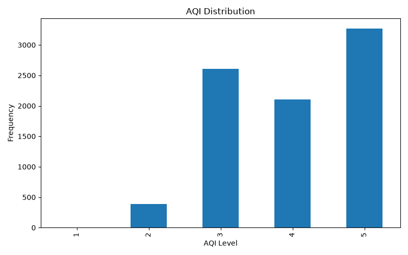
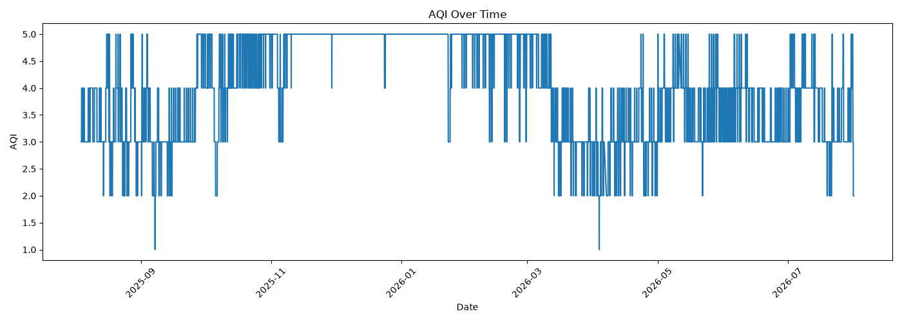
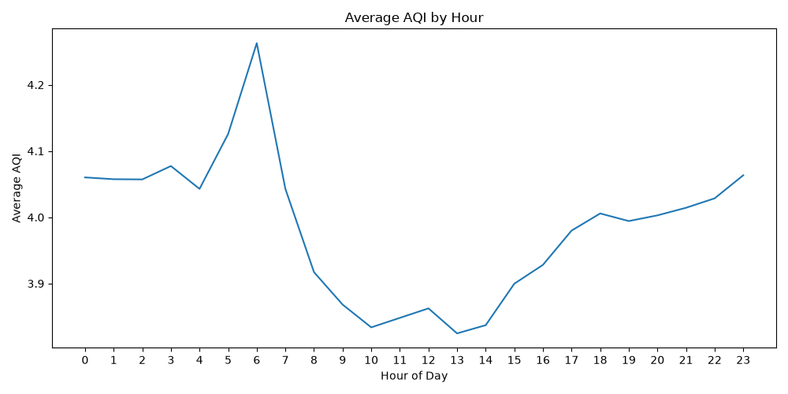
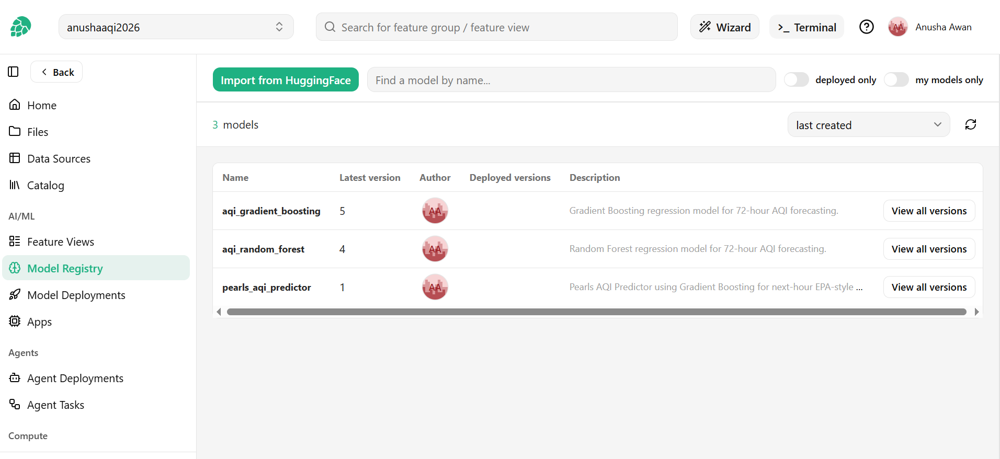
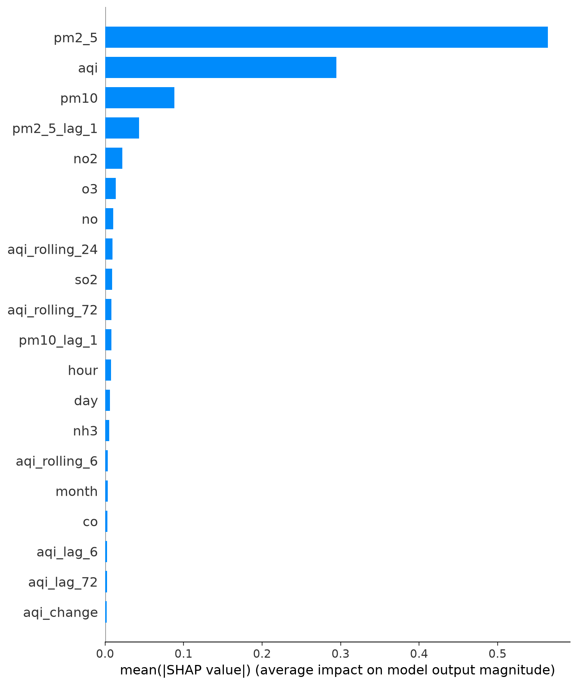
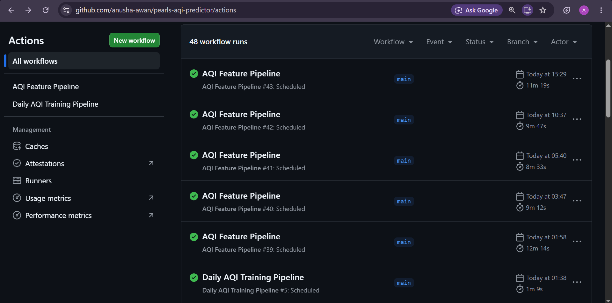
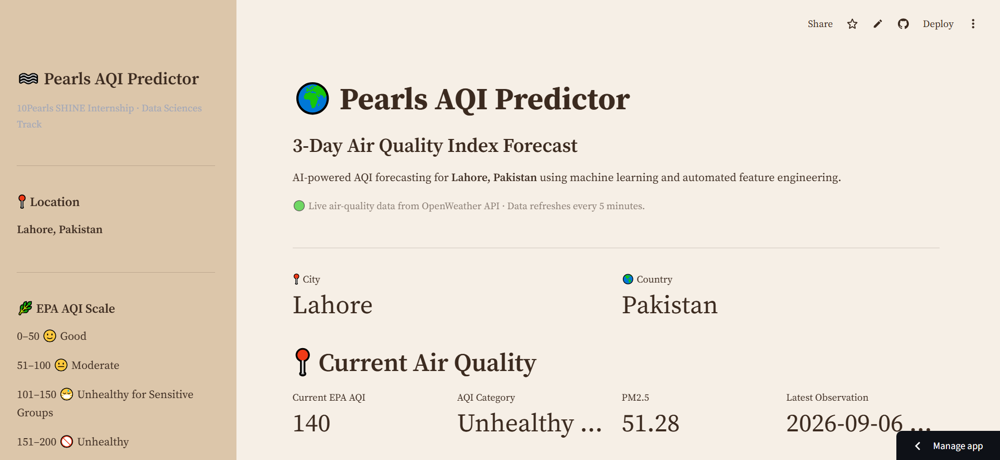

# PEARLS AQI PREDICTOR

## DATA SCIENCE INTERNSHIP PROJECT REPORT

**Submitted by:** Anusha Awan  
**Program:** BS Software Engineering  
**Institution:** Government College University, Lahore  
**Internship:** 10Pearls SHINE – Data Sciences  
**Project Submission:** September 2026

---

## 1. Project Overview

**Project Name:** Pearls AQI Predictor  
**Location:** Lahore, Pakistan  
**Project Type:** Machine Learning / Data Science

The goal of this project is to predict the Air Quality Index (AQI) of Lahore for the next three days using air-quality data and machine learning.

The project collects air-quality data, cleans and prepares the data, creates useful features, trains different machine learning models, compares their results, and selects the best model for prediction.

A Streamlit dashboard was also developed to show the current air quality, future AQI predictions, model performance, and model explainability in a simple way.

The final application uses live air-quality data from the OpenWeather API and generates a 72-hour AQI forecast.

---

## 2. Problem Statement

Air pollution is an important environmental problem in Lahore. Air quality can change over time because of different pollutants and environmental conditions.

The main question of this project is:

> Can machine learning be used to predict the AQI of Lahore for the next three days using historical and current air-quality data?

The purpose of the project is not only to show the current AQI but also to give an estimate of future AQI conditions.

---

## 3. Project Objectives

The main objectives of the project were:

- Collect air-quality data for Lahore.
- Use an external air-quality API.
- Store and prepare historical data.
- Clean the collected data.
- Create useful machine learning features.
- Calculate an EPA-style AQI using PM2.5.
- Train different machine learning models.
- Compare model performance.
- Select the best-performing model.
- Predict AQI for the next 72 hours.
- Add model explainability using SHAP.
- Explore Hopsworks Feature Store and Model Registry.
- Use GitHub Actions for automation.
- Build an interactive Streamlit dashboard.
- Connect the dashboard with live air-quality data.
- Deploy the dashboard online.

---

## 4. Initial Project Requirements

At the beginning of the project, different technologies and tools were considered.

The main technologies included:

- Python
- Pandas
- NumPy
- Scikit-learn
- TensorFlow
- OpenWeather API / AQICN
- Hopsworks or Vertex AI
- Apache Airflow or GitHub Actions
- Streamlit
- Flask or FastAPI
- SHAP
- Git and GitHub

The original idea was to build a complete data science application where data collection, processing, cloud services, machine learning, automation, and the dashboard would work together.

During development, some technologies were changed or used differently based on what worked reliably.

---

## 5. Planned Architecture

The original planned flow was:

**Air Quality API → Data Collection → Data Cleaning → Feature Engineering → Feature Store → Model Training → Model Registry → Prediction → Dashboard**

The project was divided into different parts.

### Data Source

OpenWeather API was used as the main source of air-quality data for Lahore.

### Data Processing

Python was used for:

- Data collection
- Data cleaning
- Feature engineering
- AQI calculation
- Dataset preparation

### Machine Learning

Different machine learning models were trained and compared.

### Model Management

Hopsworks was explored for:

- Feature Store
- Model Registry

### Automation

GitHub Actions was used for selected automated tasks.

### Application

Streamlit was used for the final dashboard.

The final working system was kept simpler than the original plan because Hopsworks data storage and the separate backend were not fully completed.

---

## 6. Development Journey

The project was developed step by step.

Different problems were found during development, so each major part was tested before moving forward.

The main development stages were:

1. Python environment setup
2. OpenWeather API connection
3. API testing
4. Air-quality data collection
5. Historical data creation
6. Data cleaning
7. Feature engineering
8. AQI calculation
9. Exploratory Data Analysis
10. Machine learning model training
11. Model comparison
12. Prediction testing
13. Hopsworks Feature Store exploration
14. Hopsworks Model Registry exploration
15. TensorFlow experimentation
16. SHAP explainability
17. Streamlit dashboard development
18. Live API integration
19. Forecast improvement
20. GitHub Actions automation
21. Online deployment
22. Final testing

This development process helped identify and fix several problems before the final submission.

---

## 7. Python Environment Setup

Python was used as the main programming language.

A virtual environment was created so that the project libraries could be installed separately from the main Python installation.

The project used:

**Python 3.14.3**

Important libraries included:

- pandas
- numpy
- scikit-learn
- requests
- python-dotenv
- joblib
- Streamlit
- SHAP
- matplotlib

TensorFlow was also explored during the project because it was part of the initial requirements.

---

## 8. OpenWeather API Integration

One of the first major steps was connecting the project to a real air-quality API.

OpenWeather Air Pollution API was selected as the main data source.

The project uses Lahore's coordinates:

- **Latitude:** 31.5204
- **Longitude:** 74.3587

The API provides information about different pollutants, including:

- CO
- NO
- NO₂
- O₃
- SO₂
- PM2.5
- PM10
- NH₃

The API also provides its own AQI value.

### OpenWeather AQI vs EPA AQI

An important point was identified during development.

OpenWeather provides AQI on a **1–5 scale**, while the EPA-style AQI scale used by the dashboard is **0–500**.

Because these are different scales, the OpenWeather 1–5 AQI value was not directly displayed as the final EPA-style AQI.

Instead, the project calculates the displayed AQI using the PM2.5 concentration and the corresponding AQI range.

This prevents the dashboard from showing a 1–5 value as if it were an EPA AQI value.

---

## 9. API Key Security

The OpenWeather API key was not written directly inside the source code.

During local development, the key was stored in a `.env` file.

The application reads the key using environment variables.

For the online Streamlit application, the key was stored using Streamlit Secrets.

This keeps the API key separate from the public GitHub repository.

---

## 10. Data Collection

A Python script named `save_data.py` was created to collect air-quality data.

The script:

1. Loads the API key.
2. Sends a request to OpenWeather.
3. Gets the latest air-quality information.
4. Extracts the required values.
5. Saves the current observation.
6. Adds the observation to the historical dataset.

The collected information includes:

- Timestamp
- PM2.5
- PM10
- CO
- NO
- NO₂
- O₃
- SO₂
- NH₃
- AQI-related information

The observations were stored locally in CSV files.

---

## 11. Historical Data

Historical data was needed for machine learning and analysis.

The project collected and stored observations over time to build a larger dataset.

The historical dataset was used for:

- Exploratory Data Analysis
- Feature engineering
- Model training
- Model testing
- Forecasting

The final validated local dataset contains:

- **8,402 rows**
- **28 columns**

The dataset was checked before model training.

The validation confirmed that there were:

- No missing feature values
- No duplicate datetime values

The dataset was also checked to make sure the target AQI values were within the expected 0–500 range.

---

## 12. Data Cleaning

Before training the models, the dataset was cleaned and prepared.

The cleaning process included:

- Checking missing values
- Checking duplicate timestamps
- Converting timestamps into the correct format
- Sorting data chronologically
- Selecting required columns
- Preparing numerical features
- Removing rows with missing required values

The purpose of cleaning was to make sure the machine learning models received consistent and usable data.

---

## 13. Feature Engineering

Feature engineering was one of the important parts of the project.

The raw pollutant values alone were not enough to represent the time-based patterns in air quality.

Additional features were created to help the model understand previous AQI values and time patterns.

The final production model uses **26 features**.

These include:

- Pollutant values
- Hour
- Day
- Month
- Day of week
- Previous AQI values
- PM2.5 lag values
- PM10 lag values
- Rolling AQI values
- AQI change

Lag features were used to give the model information about previous observations.

Rolling features were also used to provide information about recent AQI behavior.

These features were especially useful for the recursive 72-hour forecasting process.

---

## 14. AQI Calculation

The dashboard calculates the displayed AQI using PM2.5 concentration.

PM2.5 is an important pollutant for AQI calculation.

The project uses PM2.5 concentration and maps it to the corresponding AQI range.

The dashboard then displays:

- AQI value
- AQI category
- PM2.5 concentration

This allows the dashboard to show an EPA-style AQI instead of directly displaying the OpenWeather 1–5 AQI value.

---

## 15. Exploratory Data Analysis

Exploratory Data Analysis (EDA) was performed to understand the collected data before relying on the machine learning results.

The analysis included:

- Pollutant values
- AQI values
- Data distributions
- Feature relationships
- Historical trends
- AQI patterns over time

EDA helped in understanding the dataset and identifying useful patterns.

It also helped in checking whether the collected data looked reasonable before model training.

### EDA Figures



**Figure 1:** Distribution of AQI values in the collected dataset.



**Figure 2:** AQI variation over time in the historical dataset.



**Figure 3:** Average AQI variation by hour of the day.

---

## 16. Machine Learning Models

Different machine learning models were trained and compared.

The main models were:

- Random Forest Regressor
- Gradient Boosting Regressor
- Ridge Regression

The purpose of testing multiple models was to select the model that performed best on the test data.

Three main metrics were used.

### MAE

Mean Absolute Error shows the average difference between the actual and predicted AQI values.

A lower MAE means smaller average prediction errors.

### RMSE

Root Mean Squared Error gives more importance to larger errors.

A lower RMSE means fewer large prediction errors.

### R²

R² shows how well the model explains the variation in the target values.

A higher R² generally means better performance.

---

## 17. Model Comparison

The final model comparison results were:

| Model | MAE | RMSE | R² |
|---|---:|---:|---:|
| Random Forest | 3.6747 | 6.8945 | 0.9433 |
| Gradient Boosting | 3.5714 | 6.0362 | 0.9565 |
| Ridge Regression | 4.9105 | 7.3455 | 0.9356 |

Gradient Boosting produced the best results.

It had:

- The lowest MAE
- The lowest RMSE
- The highest R²

Therefore, **Gradient Boosting was selected as the final production model.**

---

## 18. Final Model

The final model is:

**Gradient Boosting Regressor**

The model uses **26 features**.

The target is the next-hour AQI.

The application uses this model to generate a forecast for the next 72 hours.

The forecast is generated recursively.

This means that after generating a future prediction, the system uses the updated future information when generating later predictions.

The model was selected based on the model comparison results instead of selecting it without testing other models.

---

## 19. Prediction Testing

The prediction system was tested separately during development.

The model successfully generated a 72-hour forecast.

An earlier prediction test produced approximately:

- **Minimum AQI:** 90.7
- **Maximum AQI:** 109.7
- **Average AQI:** 102.5

These values were from an earlier test run and are not fixed outputs of the final application.

Since the final application uses changing air-quality data, prediction values can change when new observations are available.

---

## 20. Hopsworks Feature Store

Hopsworks was explored as part of the project requirements.

The Hopsworks connection was successfully established.

A Feature Store named:

`aqi_features_v2`

was created.

The local dataset was validated before attempting the final upload.

The local validation showed that the dataset itself was not failing because of missing feature values or duplicate timestamps.

However, the final upload to Hopsworks did not complete successfully.

The storage operation returned the following error:

> Generic HdfsObjectStore error – RPC listener disconnected

This indicated that the problem occurred during the Hopsworks storage operation.

---

## 21. Alternative Path After Hopsworks Issue

After the Hopsworks upload problem, the project was continued using the validated local dataset.

The reason for doing this was that the local dataset had already been checked and was working correctly.

The remaining project components were completed using the local pipeline:

- Model training
- Model comparison
- Prediction
- SHAP analysis
- Dashboard development
- Live API integration
- Deployment

The Hopsworks upload problem was documented instead of claiming that the upload was successful.

This allowed the project to continue while keeping the limitation clear.

### Hopsworks Compute / Usage Limitation

During development, Hopsworks compute/resource usage also became a limitation.

Because cloud compute was limited, the project was continued locally where necessary.

The mentor confirmed that using the local VS Code application while continuing Hopsworks-related work was acceptable.


**Figure:** Hopsworks spending budget reached, causing compute to be frozen on the account.

---

## 22. Hopsworks Model Registry

Hopsworks Model Registry was also explored.

Model entries created during development included:

- `aqi_random_forest`
- `aqi_gradient_boosting`
- `pearls_aqi_predictor`

The Model Registry was used to explore model management and versioning.

Different versions were created during development as the project changed.

The final dashboard uses the saved production model and its corresponding metadata.

The report does not claim that every registry version is the exact same model version shown in the dashboard.

This version difference is documented as part of the development process.



**Figure:** Models registered in Hopsworks Model Registry.

---

## 23. TensorFlow

TensorFlow was included in the original project requirements and was explored during development.

However, it was not selected as the final production model.

The final model is the Scikit-learn Gradient Boosting Regressor because it gave the best results among the tested models.

Therefore, TensorFlow is included as an explored technology and not as the final production technology.

---

## 24. SHAP Explainability

SHAP was added to make the model easier to understand.

A machine learning model can generate a prediction without directly showing which features had the most influence.

SHAP helps explain the contribution of different features to model predictions.

The dashboard includes SHAP-based explainability information.

The analysis showed that PM2.5 was one of the strongest features influencing the model.

The dashboard reports PM2.5 as the most important feature based on the global SHAP analysis.



**Figure:** SHAP feature importance showing the contribution of model features.

---

## 25. Automation with GitHub Actions

GitHub Actions was used for selected automated project tasks.

The purpose was to reduce the amount of repeated manual work.

The project includes workflows related to tasks such as:

- Data collection
- Pipeline execution
- Project automation

Automation is useful for an AQI project because new data can be collected regularly instead of depending completely on manual execution.



**Figure:** GitHub Actions showing successful scheduled runs of the AQI Feature Pipeline and Daily AQI Training Pipeline.

---

## 26. Streamlit Dashboard

A Streamlit dashboard was developed as the main interface of the project.

The dashboard presents the current air quality and future predictions in a simple format.

The dashboard includes:

- Current AQI
- AQI category
- PM2.5
- Three-day forecast
- Maximum predicted AQI
- Model performance
- SHAP information
- Dataset information
- Model information
- About section

The dashboard was designed so that users can understand the results without needing to understand the machine learning code.

---

## 27. Live OpenWeather Integration

The final dashboard was connected directly to the live OpenWeather API.

The application first attempts to retrieve fresh air-quality data.

The basic flow is:

**Streamlit Secrets → OpenWeather API → Latest Air Quality → AQI Calculation → Prediction**

If the live API request fails, the application can use the latest stored observation as a fallback.

This makes the application more reliable because a temporary API problem does not necessarily stop the dashboard from displaying data.

---

## 28. Live Data Refresh

The dashboard uses live air-quality information and refreshes periodically.

The current implementation uses an approximately **five-minute refresh interval**.

This allows the application to use newer air-quality observations instead of depending only on an old stored observation.

---

## 29. Final Dashboard Example

The final dashboard was tested using live air-quality data.

One final dashboard run showed:

- **Latest observation:** 2026-09-06 11:07
- **Current EPA AQI:** 137
- **AQI Category:** Unhealthy for Sensitive Groups
- **PM2.5:** 50.34

### Three-Day Forecast

| Day | Predicted AQI |
|---|---:|
| Day 1 | 112.3 |
| Day 2 | 130.5 |
| Day 3 | 124.7 |

**Maximum predicted AQI:** 159.3

These values are from one final test run.

Because the dashboard uses live air-quality data, the values can change when new observations are available.



**Figure:** Final Pearls AQI Predictor dashboard showing live AQI and different three-day forecast values.

---

## 30. Dashboard Design

The dashboard was customized instead of using the default Streamlit appearance.

A light cream and brown theme was selected.

The main design choices were:

- Cream background
- Brown primary color
- Dark brown text
- Serif font
- Soft neutral colors

The purpose was to create a simple and distinctive interface.

The theme was configured through Streamlit's theme settings instead of using unnecessary custom CSS.

---

## 31. User Interface Features

The dashboard was kept simple so users can quickly understand the important information.

### Current Air Quality

Shows the latest AQI and pollutant information.

### AQI Forecast

Shows the predicted AQI for the next three days.

### Model Performance

Shows the performance of the tested machine learning models.

### Explainability

Shows SHAP-based model information.

### Data and Model Information

Shows information about the dataset and model used.

### About

Explains the purpose of the project.

---

## 32. Application Serving Layer

Streamlit is used as the main application and presentation layer.

The dashboard directly:

- Loads the trained model
- Gets the latest air-quality data
- Processes the data
- Creates the required features
- Generates the forecast
- Displays the results

A separate Flask or FastAPI backend was not implemented in the final version.

Flask/FastAPI was part of the original project requirements, but adding another backend was not necessary for the working Streamlit application.

The decision was made to keep the working application stable rather than adding another layer at the final stage without confirmation that it was required.

---

## 33. Git and GitHub

Git was used for version control throughout the project.

The project was maintained in a GitHub repository.

**Repository:**  
https://github.com/anusha-awan/pearls-aqi-predictor

Git was used to:

- Track changes
- Commit updates
- Push project files
- Maintain project history
- Support deployment

Sensitive API keys were kept outside the public source code.

---

## 34. Deployment

The Streamlit application was deployed online.

**Live Dashboard:**  
https://pearlsaqi2026.streamlit.app/

The deployed application uses Streamlit Secrets for the OpenWeather API key.

This allows the application to request live air-quality data without exposing the API key in the GitHub repository.

---

## 35. Testing

Testing was performed throughout the project instead of only at the end.

The main types of testing included:

- API testing
- Data validation
- Model testing
- Prediction testing
- Local dashboard testing
- Cloud deployment testing
- Live API testing

---

## 36. API Testing

The OpenWeather API was initially tested separately.

An authentication problem occurred during the first API tests.

The API returned:

> 401 – Invalid API Key

The API key configuration was checked and corrected.

After fixing the setup, the API returned:

> 200 – Successful response

The returned JSON was then checked to make sure the required pollutant values were available.

---

## 37. Local Application Testing

The Streamlit dashboard was tested locally before deployment.

During testing, the dashboard successfully:

- Loaded the application
- Loaded the API key
- Requested air-quality data
- Calculated AQI
- Generated predictions
- Displayed model information
- Displayed SHAP information

One issue was found where the local `.env` file was not being loaded before the API key was accessed.

The problem was fixed by using `load_dotenv()` before reading the API key.

After the fix, the application was able to access the local API key correctly.

---

## 38. Cloud Deployment Testing

After local testing, the application was deployed to Streamlit.

The OpenWeather API key was added through Streamlit Secrets.

The key was stored using the required TOML format.

The deployed dashboard was then tested for:

- Live API access
- Current AQI
- Updated timestamps
- Future predictions
- Dashboard loading
- Model information
- SHAP information

This confirmed that the deployed application could access the required API without exposing the API key publicly.

---

## 39. Problems Faced During Development

Several problems were encountered during development.

| Problem | What I Did |
|---|---|
| OpenWeather returned a 401 invalid API key error | Checked and corrected the API key configuration |
| Local application could not read the API key | Added `.env` loading using `load_dotenv()` |
| OpenWeather AQI used a 1–5 scale | Calculated the dashboard AQI using PM2.5 and an EPA-style scale |
| Hopsworks compute/resources became limited | Continued required development locally and documented the limitation |
| Hopsworks data upload failed | Validated the data locally and continued with the local dataset |
| Hopsworks returned an RPC listener/storage error | Treated it as a storage-side problem and documented it |
| Cloud dashboard needed the API key | Added the key using Streamlit Secrets |
| API key could be exposed in a public repository | Kept it in `.env` and Streamlit Secrets |
| Different model versions existed during development | Documented the registry/version difference |
| Dashboard initially used stored data | Added live OpenWeather API integration |
| Initial 72-hour forecast showed the same AQI for all days | Checked the recursive prediction path and future input values |
| Future pollutant values were not changing during the first forecast approach | Added historical time-based pollutant estimates for future hours |
| Complex UI customization could create additional problems | Used Streamlit theme settings instead of unnecessary CSS |

---

## 40. Important Design Decisions

Several decisions were made during development.

### Decision 1: Use OpenWeather

OpenWeather was selected because it provided the required air-quality pollutant data for Lahore through an accessible API.

### Decision 2: Calculate AQI from PM2.5

The OpenWeather AQI is on a 1–5 scale.

Therefore, it was not used directly as the final EPA-style AQI.

PM2.5 was used to calculate the dashboard AQI.

### Decision 3: Use Gradient Boosting

Three models were compared.

Gradient Boosting achieved the best results, so it was selected as the final model.

### Decision 4: Keep a Local Fallback

The dashboard can use stored data if the live API request fails.

This makes the application more reliable.

### Decision 5: Use Streamlit

Streamlit allowed the complete prediction system to be presented through an interactive dashboard without needing a separate frontend.

### Decision 6: Continue Locally After the Hopsworks Problem

The local dataset had already been validated.

When the Hopsworks storage problem appeared, development continued using the working local pipeline instead of stopping the project.

### Decision 7: Improve the Forecast Instead of Using Fixed Values

During testing, the first version of the 72-hour forecast showed the same AQI value for all three days.

This was identified as a problem.

The prediction path was checked and the future pollutant inputs were improved.

Instead of keeping future pollutant values equal to the current live values for every future hour, historical time-based pollutant patterns were used to estimate future pollutant values.

This allowed the recursive forecast to change over time.

The final dashboard now shows different predicted values for Day 1, Day 2, and Day 3.

---

## 41. Current System Flow

The final working system follows this flow:

```text
OpenWeather API
       ↓
Live Air-Quality Data
       ↓
Python Data Processing
       ↓
Feature Engineering
       ↓
AQI Calculation
       ↓
Gradient Boosting Model
       ↓
72-Hour Recursive Forecast
       ↓
SHAP Explainability
       ↓
Streamlit Dashboard
       ↓
Online Deployment

The Hopsworks Feature Store and Model Registry were explored during development, but the final production training dataset remained local because of the Hopsworks storage limitation.

---

## 42. What Is Fully Working

The following components are working in the final project:

- Python environment
- OpenWeather API integration
- Live air-quality data collection
- Historical data handling
- Data cleaning
- Feature engineering
- PM2.5-based AQI calculation
- Machine learning model training
- Model comparison
- Gradient Boosting model
- 72-hour AQI prediction
- Recursive forecasting
- SHAP explainability
- Streamlit dashboard
- Live OpenWeather integration
- Streamlit Secrets
- GitHub repository
- GitHub Actions automation
- Online Streamlit deployment

---

## 43. What Has Limitations

Some parts of the original project requirements were not completed exactly as initially planned.

### Hopsworks Data Upload

The Hopsworks connection was successful and the `aqi_features_v2` Feature Store was created.

However, the final data upload failed with:

> Generic HdfsObjectStore error – RPC listener disconnected

The local dataset was validated before the upload attempt.

The final validated local dataset contains:

- 8,402 rows
- 28 columns
- No missing feature values
- No duplicate datetime values

Because the problem occurred during the Hopsworks storage operation, the validated local dataset was used for final model training and prediction.

### Flask/FastAPI

A separate Flask or FastAPI backend was not implemented.

Streamlit currently handles the application and presentation layer.

### TensorFlow

TensorFlow was explored but was not selected as the final production model.

### Feature Store Training

The final production model was trained using the validated local `features.csv` dataset rather than directly retrieving the training data from Hopsworks.

### Model Registry Version Difference

Model Registry entries were created during development, but the dashboard's saved production model metadata does not represent every registry version.

This is documented instead of treating all versions as identical.

---

## 44. Model Performance Summary

The final model evaluation was:

| Model | MAE | RMSE | R² |
|---|---:|---:|---:|
| Random Forest | 3.6747 | 6.8945 | 0.9433 |
| Gradient Boosting | 3.5714 | 6.0362 | 0.9565 |
| Ridge Regression | 4.9105 | 7.3455 | 0.9356 |

Gradient Boosting achieved the best results.

The final model has:

- **MAE:** 3.5714 AQI points
- **RMSE:** 6.0362 AQI points
- **R²:** 0.9565

The model therefore provides a strong fit on the held-out test data.

However, these metrics should not be interpreted as a guarantee that every future AQI prediction will have the same error because real air quality can change unexpectedly.

---

## 45. Project Strengths

The project has several strengths:

- Uses real air-quality data.
- Uses a live external API.
- Builds and stores historical data.
- Performs data cleaning.
- Performs feature engineering.
- Compares multiple machine learning models.
- Selects the final model using evaluation results.
- Provides a 72-hour AQI forecast.
- Uses recursive forecasting.
- Includes SHAP explainability.
- Uses GitHub for version control.
- Uses GitHub Actions for automation.
- Provides an interactive dashboard.
- Uses secure API-key handling.
- Is deployed online.
- Provides a simple user interface.
- Documents technical problems honestly.
- Provides a local fallback when cloud/API problems occur.

---

## 46. Limitations

The current system has several limitations.

### Limited Location

The current project is designed for Lahore, Pakistan.

### API Dependency

The live dashboard depends on the availability of the OpenWeather API.

### Forecast Uncertainty

Machine learning predictions are estimates.

Actual future AQI can be different because weather, traffic, industrial activity, seasonal conditions, and other environmental factors can change.

### Hopsworks Storage Issue

The Hopsworks Feature Store was created, but the final data upload could not be completed because of the storage-layer RPC error.

### No Separate REST API

The final version does not include a separate Flask or FastAPI backend.

### Local Training Dataset

The final model uses the validated local dataset instead of directly retrieving training data from Hopsworks.

### Limited Environmental Variables

The model mainly uses air-quality measurements and time-based features.

Adding more weather and environmental information could improve future predictions.

### Forecast Method

The current 72-hour forecast uses recursive prediction and estimated future pollutant inputs.

Because future pollutant values are not directly known, the forecast can still contain uncertainty.

---

## 47. Future Flask/FastAPI Architecture

If a separate Flask or FastAPI backend is required in the future, it can be added without rebuilding the complete project.

A future architecture could be:

```text
OpenWeather API
       ↓
Flask/FastAPI Backend
       ↓
Data Processing
       ↓
Feature Engineering
       ↓
ML Model
       ↓
AQI Prediction
       ↓
Streamlit Dashboard

The backend could handle prediction requests while Streamlit focuses mainly on the user interface.

The existing model and prediction logic can be reused.

## 48. Security Considerations

Security was considered during development.

The OpenWeather API key was not hard-coded into the public GitHub repository.

During local development, the key was stored in `.env`.

During Streamlit deployment, the key was stored using Streamlit Secrets.

This prevents the key from being directly exposed in the source code.

The `.env` file was kept outside the public project files.

---

## 49. Final Result

The final project provides a working AQI prediction application for Lahore.

The system can:

- Collect current air-quality data.
- Process the collected data.
- Calculate the current EPA-style AQI from PM2.5.
- Prepare machine learning features.
- Load the trained Gradient Boosting model.
- Generate a 72-hour AQI forecast.
- Provide model performance information.
- Provide SHAP-based explainability.
- Display current AQI information.
- Display future AQI predictions.
- Use live OpenWeather data.
- Present results through a Streamlit dashboard.
- Run as an online deployed application.

The project also includes GitHub Actions automation and Hopsworks Feature Store and Model Registry exploration.

---

## 50. Lessons Learned

This project helped me understand that a data science project involves much more than training a machine learning model.

During the project, I learned about:

- Working with real-world APIs.
- Handling API errors.
- Protecting API keys.
- Collecting historical data.
- Cleaning datasets.
- Feature engineering.
- Calculating AQI from PM2.5.
- Training machine learning models.
- Comparing different models.
- Evaluating model performance.
- Creating future predictions.
- Recursive forecasting.
- Using SHAP for explainability.
- Exploring Feature Stores.
- Using Model Registry.
- Using GitHub Actions.
- Building dashboards with Streamlit.
- Deploying applications online.
- Debugging deployment problems.
- Handling cloud-service limitations.

One of the most important lessons was that real-world projects can have problems even when the code and data are working correctly.

For example, the Hopsworks storage operation failed even after the local dataset had been validated.

Another important lesson came from the forecasting problem. The first version of the forecast showed almost the same AQI value for the future days. Instead of ignoring the issue, I checked the prediction path and improved the future input values.

This showed me that model development does not end when a model produces a prediction. The complete prediction pipeline also needs to be checked.

---

## 51. Conclusion

Pearls AQI Predictor was developed to predict the AQI of Lahore for the next three days using machine learning.

The project started with live air-quality data collection through OpenWeather and gradually developed into a complete working data science application involving:

- Data collection
- Data cleaning
- Feature engineering
- AQI calculation
- Exploratory analysis
- Machine learning
- Model comparison
- 72-hour forecasting
- SHAP explainability
- Automation
- Dashboard development
- Deployment

Three machine learning models were compared.

Gradient Boosting performed the best with:

- **MAE = 3.5714**
- **RMSE = 6.0362**
- **R² = 0.9565**

The final application uses live OpenWeather data and generates a 72-hour AQI forecast through recursive prediction.

During development, some problems were encountered, including API authentication issues, Hopsworks compute/resource limitations, Hopsworks storage errors, environment-variable issues, and an initial problem where future AQI predictions were not changing properly.

These issues were tested, documented, and fixed or handled using suitable alternatives.

The Hopsworks Feature Store and Model Registry were explored successfully, but the final feature-data upload was not completed because of the storage-layer error.

The final project therefore represents a working end-to-end machine learning application with its limitations clearly documented.

---

## 52. Technologies Used

| Technology | Purpose |
|------------|---------|
| Python | Main programming language |
| Pandas | Data processing |
| NumPy | Numerical operations |
| Scikit-learn | Machine learning |
| TensorFlow | Experimental exploration |
| OpenWeather API | Live air-quality data |
| Hopsworks | Feature Store and Model Registry exploration |
| SHAP | Model explainability |
| GitHub Actions | Automation |
| Streamlit | Dashboard and application layer |
| Git | Version control |
| GitHub | Code repository |
| Matplotlib | Data visualization |
| Joblib | Model saving and loading |
| python-dotenv | Local environment variable management |

---

## 53. Project Links

### GitHub Repository

https://github.com/anusha-awan/pearls-aqi-predictor

### Live Streamlit Dashboard

https://pearlsaqi2026.streamlit.app/

---

## 54. Final Project Status

**Overall Status: Completed working prototype with documented limitations**

### Working Components

- Python environment
- OpenWeather API
- Live air-quality data collection
- Historical data collection
- Data cleaning
- Feature engineering
- PM2.5-based AQI calculation
- Machine learning model training
- Model comparison
- Gradient Boosting model
- 72-hour recursive forecasting
- SHAP explainability
- Streamlit dashboard
- Live API integration
- Secure API-key handling
- GitHub repository
- GitHub Actions automation
- Streamlit deployment

### Partially Completed / Limited Components

- Hopsworks Feature Store data upload
- Direct Feature Store-based training
- TensorFlow production model
- Separate Flask/FastAPI backend
- Full Hopsworks-based production pipeline

The final project is therefore presented as a working end-to-end machine learning application.
